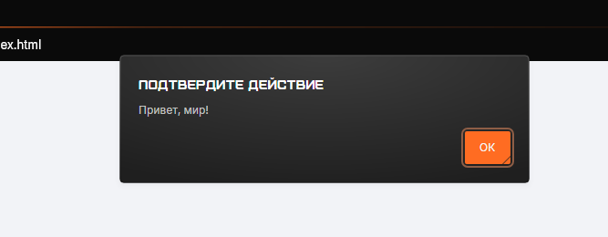
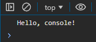
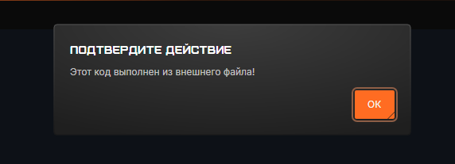
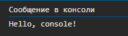
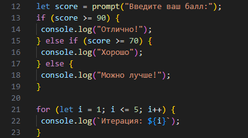

# Лабораторная работа №1: Введение в JavaScript

## Цель:
Познакомиться с основами JavaScript, научиться писать и выполнять код в браузере и в локальной среде, разобраться с базовыми конструкциями языка.

## Ход работы
- `index.html` – основная HTML-страница.
- `index.js` – внешний файл *JavaScript*.
- `screenshots` - папка с скриншотами по проделанной работе.
- `readme.md` - отчёт по лабораторной работе.

## Задание 1. Выполнение кода JS в браузере
1. Открываю файл `index.html` в браузере:


 Ввод команды *console.log("Hello, world!");* 

 
 Ввод в консоль выражения *2 + 3.*
   
   
   
2. Создание HTML-страницы с подключением JavaScript:

   ```js
<!DOCTYPE html>
<html lang="en">
 <head>
   <title>Привет, мир!</title>
   <script src="index.js"></script>
 </head>
 <body>
  <script>
    alert("Привет, мир!");
    console.log("Hello, console!");
  </script>
 </body>
</html>
   ```


   *Проверка выполнения*


   


   

4. Добавление `index.js`:

```js
alert("Этот код выполнен из внешнего файла!");
console.log("Сообщение в консоли");
```
   
   *Проверка выпонления*


   


   


## Задание 2. Работа с типами данных

1. В файле script.js создаю несколько переменных:
- `name` - строка с вашим именем.
- `birthYear` - число, представляющее год вашего рождения.
- `isStudent` - логическая переменная, указывающая, являетесь ли вы студентом.


Добавляю следующий код в `index.js`:


```js
let name="Egor"
let birthYear="2006"
let isStudent="True"

console.log("Имя:", name);
console.log("Год:", birthYear);
console.log("Студент:", isStudent);

```

*Проверка выполнения*


2. Управление потоком выполнения (условия и циклы):


Добавляю следующий код в `index.js`:



*Проверка выполнения*


## Контрольные вопросы
1. Чем отличаются `var`, `let` и `const`?

- `var` – старая переменная, видна везде внутри функции, можно объявлять заново.
- `let` – современная переменная, видна только в своём блоке {}, можно менять.
- `const` – как let, но нельзя менять значение после присвоения.

2. Что такое неявное преобразование типов в JavaScript?

Неявное преобразование типов в JavaScript — это автоматическое изменение одного типа данных на другой при выполнении операций. Например, "7" + 9 превращает число в строку ("79"), а "7" - 9 превращает строку в число (2).

3. Как работает оператор `==` в сравнении с `===`?

`==` (нестрогое сравнение) – сравнивает значения, игнорируя типы, и выполняет неявное преобразование.

`===` (строгое сравнение) – сравнивает и значения, и типы, без преобразования.


## Заключение
В ходе данной лабораторной работы я изучил основы JavaScript и научился запускать код как через консоль разработчика в браузере, так и с помощью HTML-страницы. Я освоил подключение внешнего JavaScript-файла и использование встроенного тега `<script>` в HTML.

В процессе работы я познакомился с основными типами данных в  JavaScript (строки, числа, логические значения), различиями между `let`, `const` и `var` при объявлении переменных, а также с управлением потоком выполнения с помощью условных операторов `if-else`. Кроме того, я разобрался в использовании циклов for для автоматизации повторяющихся операций.

Практические задания помогли мне закрепить знания о синтаксисе языка и его ключевых конструкциях. Теперь я понимаю, как с помощью JavaScript динамически изменять содержимое веб-страницы.
