# Лабораторная работа №1: Введение в JavaScript

## Цель:
Познакомиться с основами JavaScript, научиться писать и выполнять код в браузере и в локальной среде, разобраться с базовыми конструкциями языка.

## Ход работы
- `index.html` – основная HTML-страница.
- `script.js` – внешний файл *JavaScript*.
- `screenshots` - папка с скриншотами по проделанной работе.
- `readme.md` - отчёт по лабораторной работе.

## Задание 1. Выполнение кода JS в браузере
1. Открываю файл `index.html` в браузере:

 Ввод команды *console.log("Hello, world!");* 

 
 Ввод в консоль выражения *2 + 3.*
   
   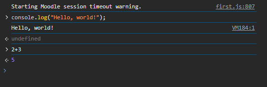
   
2. Создание HTML-страницы с подключением JavaScript:

   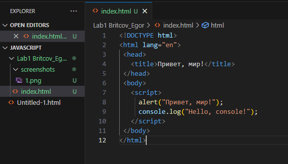

   *Проверка выполнения*

   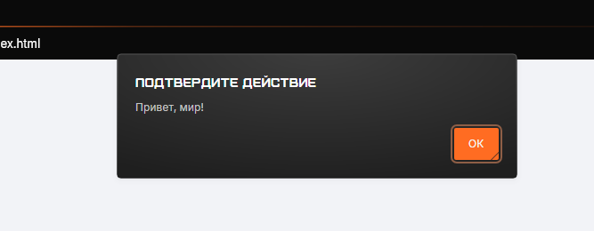

   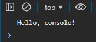

4. Добавление `index.js`:

   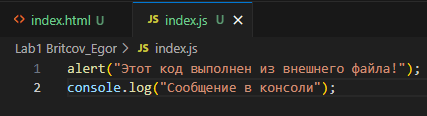
   
   *Проверка выпонления*

   

   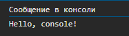

## Задание 2. Работа с типами данных

1. В файле script.js создаю несколько переменных:
- `name` - строка с вашим именем.
- `birthYear` - число, представляющее год вашего рождения.
- `isStudent` - логическая переменная, указывающая, являетесь ли вы студентом.

Добавляю следующий код в `index.js`:

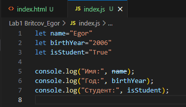

*Проверка выполнения*

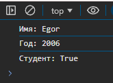

2. Управление потоком выполнения (условия и циклы):

Добавляю следующий код в `script.js`:

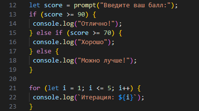

*Проверка выполнения*

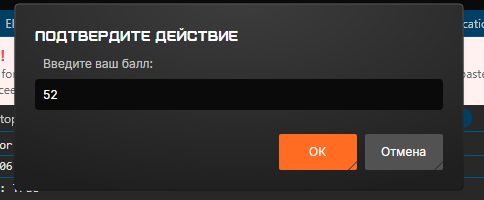

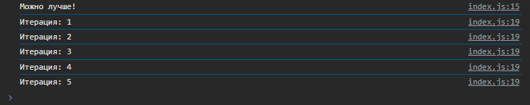

## Контрольные вопросы
1. Чем отличаются `var`, `let` и `const`?

var — устаревший способ объявления переменных, его можно переопределять, а область видимости охватывает всю функцию. let имеет блочную область видимости (доступен только внутри {}) и не позволяет повторно объявлять переменную. const похож на let, но не позволяет изменять значение переменной после присваивания. Лучше использовать let и const, а var избегать.

2. Что такое неявное преобразование типов в JavaScript?

Неявное преобразование типов — это когда JavaScript автоматически меняет тип данных переменной. Например, "5" + 2 даст "52", так как число 2 превращается в строку. А "10" - 5 даст 5, потому что строка "10" преобразуется в число. Иногда это удобно, но может приводить к неожиданным результатам, поэтому лучше явно указывать типы.

3. Как работает оператор `==` в сравнении с `===`?

== сравнивает значения, но может преобразовывать типы, например, 5 == "5" вернет true. === сравнивает и значения, и их типы, поэтому 5 === "5" вернет false. Лучше использовать ===, чтобы избежать неожиданных ошибок из-за преобразования типов.

## Заключение
В ходе выполнения данной лабораторной работы я познакомился с основами JavaScript, научился выполнять код как в браузере через консоль разработчика, так и с помощью HTML-страницы. Я освоил подключение внешнего JavaScript-файла и использование встроенного <script> в HTML.

- Основные типы данных в JavaScript (строки, числа, логические значения).
- Объявление переменных с let, const и var и их различия.
- Управление потоком выполнения с помощью условных операторов (if-else).
- Использование циклов (for) для повторяющихся операций.

Практическое выполнение заданий помогло закрепить знания о синтаксисе языка и его основных конструкциях. Теперь я понимаю, как динамически управлять содержимым веб-страницы с помощью JavaScript.
