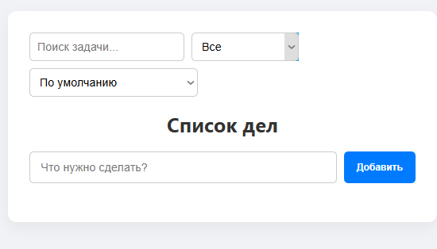
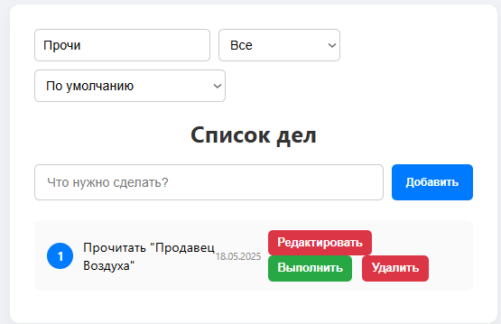
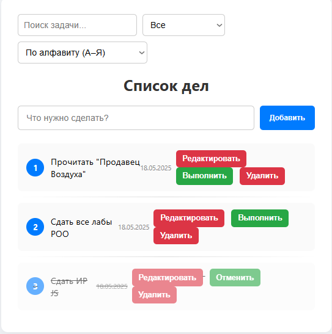
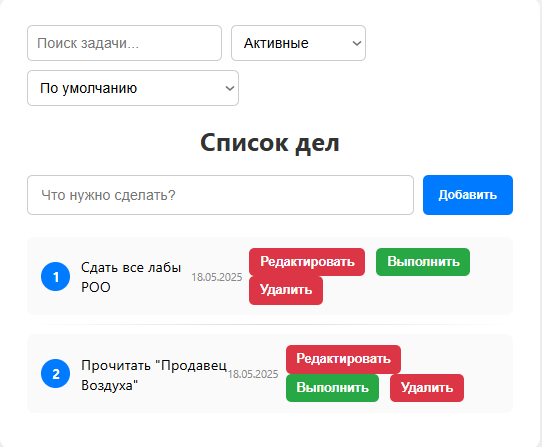
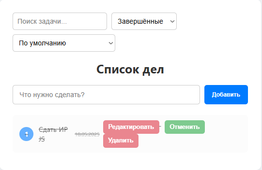
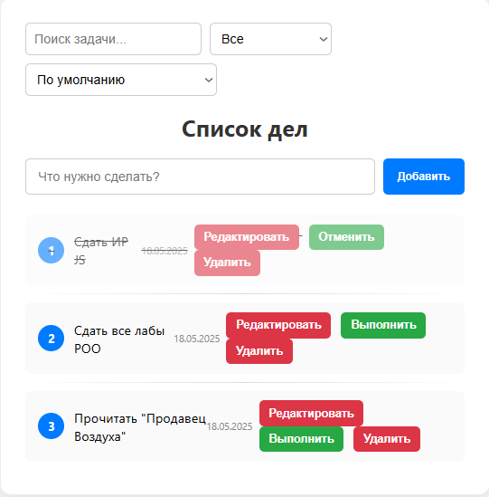

#  цйTo-Do List — Индивидуальный проект по JavaScript
### Выполнил студент: *Бритков Егор*
### Группа: *I2402*
---
## Инструкции по установке и запуску проекта
### Основные шаги для запуска приложения:
- Скачайте папку с проектом.

- Запустите локальный веб-сервер:
- Поскольку проект использует модули JavaScript `<script type="module">`, его нельзя запускать простым открытием файла index.html в браузере — необходим локальный сервер.

- Рекомендуемый способ:
Установите расширение Live Server в Visual Studio Code. Откройте папку проекта в VS Code, щёлкните правой кнопкой мыши на index.html и выберите "Open with Live Server".

- Альтернативные способы:
Можно использовать любой другой локальный сервер, например, с помощью Node.js.

- Откройте приложение в браузере:
При использовании Live Server оно откроется автоматически. В других случаях — перейдите по адресу, который предоставит ваш сервер обычно это `http://localhost:PORT`.

##  Цель проекта

### Разработка интерактивного веб-приложения **To-Do List (Список дел)** с использованием чистого JavaScript (Vanilla JS), без использования сторонних библиотек и фреймворков. Проект демонстрирует практические навыки работы с DOM, событиями, формами, массивами объектов, локальным хранением данных и модульной организацией кода.

---

##  Основные функции

- Добавление задач

Создаёт новую задачу, если текст содержит не менее 3 символов. Задача получает уникальный `id`, текущую дату создания и статус `не выполнено`.
```js
export function addTodo(text) {
  if (text.trim().length < 3) return false;

  const todo = {
    id: Date.now(),
    text,
    completed: false,
    createdAt: new Date().toISOString()
  };

  todos.push(todo);
  saveTodos();
  return true;
}
```
---
- Редактирование задач

Позволяет изменить текст задачи. При вводе менее 3 символов редактирование не сохраняется.
```js
export function editTodo(id, newText) {
  if (newText.trim().length < 3) return false;

  todos = todos.map(todo =>
    todo.id === id ? { ...todo, text: newText } : todo
  );
  saveTodos();
  return true;
}
```
---
- Выполнение/отмена выполнения задач

Изменяет статус задачи на выполненный или невыполненный по клику пользователя.
```js
export function toggleComplete(id) {
  todos = todos.map(todo =>
    todo.id === id ? { ...todo, completed: !todo.completed } : todo
  );
  saveTodos();
}
```
---
- Удаление задач

Удаляет задачу по её `id`.
```js
export function deleteTodo(id) {
  todos = todos.filter(todo => todo.id !== id);
  saveTodos();
}
```
- Фильтрация: все / активные / завершённые

Позволяет отобразить:

- все задачи;

- только активные (не выполненные);

- только завершённые.
```js
const filterValue = filterSelect.value;
if (filterValue === 'active') {
  filtered = filtered.filter(t => !t.completed);
} else if (filterValue === 'completed') {
  filtered = filtered.filter(t => t.completed);
}
```
---
- Поиск задач по ключевому слову

Фильтрует задачи по введённому тексту, не завися от регистра.
```js
const searchValue = searchInput.value.trim().toLowerCase();
if (searchValue) {
  filtered = filtered.filter(t => t.text.toLowerCase().includes(searchValue));
}
```
---
- Сортировка:
  - по алфавиту (А–Я / Я–А)
  - по дате создания (от новых к старым и наоборот)
```js
  const sortValue = sortSelect.value;
if (sortValue === 'az') {
  filtered.sort((a, b) => a.text.localeCompare(b.text));
} else if (sortValue === 'za') {
  filtered.sort((a, b) => b.text.localeCompare(a.text));
} else if (sortValue === 'date-asc') {
  filtered.sort((a, b) => new Date(a.createdAt) - new Date(b.createdAt));
} else if (sortValue === 'date-desc') {
  filtered.sort((a, b) => new Date(b.createdAt) - new Date(a.createdAt));
}
```
---
- Отображение даты создания задачи

Каждая задача отображает дату, когда она была добавлена.
```js
// js/data.js
createdAt: new Date().toISOString()

// js/ui.js
<span class="date">${new Date(todo.createdAt).toLocaleDateString()}</span>
```
---
- Нумерация задач

Каждой задаче присваивается порядковый номер при отображении.
```js
filtered.forEach((todo, index) => {
  li.innerHTML = `
    <div class="todo-item">
      <span class="number">${index + 1}</span>
      ...
    </div>
  `;
});
```
---
- Хранение данных в `localStorage`

Все изменения автоматически сохраняются в `localStorage`, чтобы данные не терялись при перезагрузке страницы.
```js
export function saveTodos() {
  localStorage.setItem('todos', JSON.stringify(todos));
}

export function loadTodos() {
  const saved = localStorage.getItem('todos');
  if (saved) {
    todos = JSON.parse(saved);
  }
}
```
---

##  Техническая реализация

- **Технологии:** HTML5, CSS3, Vanilla JavaScript (ES6+)
- **Модульная структура:** разделение кода на `data.js`, `ui.js`, `index.js`
- **Хранение данных:** `localStorage`
- **Документация:** JSDoc
- **Стилизация:** собственный CSS с медиа-запросами для мобильных устройств

---
## Пример интерфейса
 Стартовый интерфейс



 Поиск Задачи



Сортировка по Алфавиту



Сортировка по Активным задачам



Сортировка по Выполненным задачам



Финальный результат




## Вывод
В рамках данной работы было реализовано веб-приложение "To-Do List" — простой и функциональный список задач. Проект демонстрирует ключевые основы фронтенд-разработки с использованием JavaScript.

В процессе разработки были использованы:

- взаимодействие с DOM для динамического отображения задач;

- обработка пользовательских событий (добавление, редактирование, удаление и отметка выполнения задач);

- работа с массивами объектов для хранения списка дел;

- фильтрация, поиск и сортировка задач;

- охранение данных в localStorage для обеспечения постоянства между сессиями.

Код написан с использованием модульного подхода и современного синтаксиса ES6+, что делает его структурированным, читаемым и удобным для масштабирования.

Таким образом, цель проекта — освоение базовых навыков создания интерактивных веб-приложений на JavaScript — была успешно достигнута.
